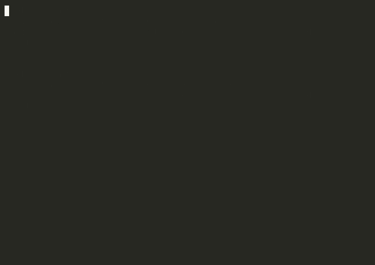

<p align="center"></p>

# Jugnu

Run **Qwen3.6-35B-A3B** (int4, text-only) locally on a **16 GB Apple Silicon
Mac**. No cloud, no account, no telemetry, no GPU.

Jugnu is ~4,000 lines of dependency-free C. It keeps 1.3 GB of dense weights
resident in RAM and streams the 16.6 GB of mixture-of-experts weights from
SSD on demand, so a 35B-parameter model fits in a 2–3 GB memory footprint.

## Demo

Generation and memory footprint, live (35B parameters, 2.5 GB peak RSS):

<p align="center"></p>

Reproduce it yourself after installing: `./demo.sh`

## Install

```sh
curl -fsSL https://huggingface.co/deepanwa/Jugnu-Qwen3.6-35B-A3B-int4/resolve/main/install.sh | sh
```

Requirements: Apple Silicon Mac (M1 or newer), 16 GB RAM, ~25 GB free disk.
The installer checks the machine, downloads ~18 GB (resumable, every file
SHA-256-verified), compiles the engine locally, and runs a smoke test.
No admin rights needed. Uninstall: `rm -rf ~/.jugnu`.

## Use

```sh
jugnu "explain how a hash table handles collisions"
jugnu --continue "and which strategy does Python use?"  # resumes last conversation
jugnu --think "tricky logic puzzle"                     # chain-of-thought mode
jugnu --fast "..."                                      # all P-cores
jugnu --long "..."                                      # up to 2048 output tokens
jugnu doctor                                            # verify the install
```

`--continue` restores the previous conversation from a ~70 MB snapshot
instead of re-processing the history, including across reboots. 30 of the
model's 40 layers are DeltaNet linear-attention layers with a fixed 63 MB
state, and only 10 layers keep a KV cache (~40 KB/token), which is what makes
the snapshot small and the resume exact: continuation output is byte-identical
to an uninterrupted session.

## Performance (measured, MacBook Air M3 16 GB, fanless)

| workload | tokens/s |
|---|---|
| decode, default (2 threads) | 7–8 |
| decode, `--fast` (4 threads) | ~9.5 |
| prefill, default | ~14 |
| prefill, `--fast` | ~24 |

Peak RSS 2–3 GB; zero swap; the engine performs no disk writes except the
session snapshot. Engine output is validated bit-exact against a
quantization-aware reference implementation (teacher-forcing and generation),
and the release configuration passed a gated benchmark suite (100-prompt
corpus, 15-minute soak, swap/write/thermal guardrails).

## Build from source

```sh
make            # portable single-threaded build
make omp        # multithreaded (brew install libomp first)
make test       # standalone cache test suites
```

`tools/convert_qwen36.py` reproduces the int4 container from the original
checkpoint shard-by-shard in under 25 GB of working disk.

## Platform support

- **macOS, Apple Silicon** — tested.
- **Linux (x86_64/ARM)** — untested; the code is POSIX and `kernels.h` has an
  AVX2 path. A fast NVMe (~3 GB/s) matters more than the CPU. PRs welcome.
- **Windows** — not supported natively (POSIX I/O). WSL2 untested.

## Architecture notes

- int4 experts (per-row scales), int8 activations with SDOT/AVX2 integer-dot
  kernels; `IDOT=0` switches to exact f32 kernels for validation.
- Expert blobs are 16 KB-aligned and streamed with F_NOCACHE + F_RDADVISE;
  a byte-budget LRU cache with per-layer floors handles residency, and a
  kernel memory-pressure poll evicts under system pressure (zero-swap
  verified under a forced WARN storm).
- Gated DeltaNet recurrence and causal-conv are parallelized per-head /
  per-channel with the per-chain float operation order preserved
  (bit-identical to the sequential implementation).
- Sessions (`QWSESS01`): geometry-bound, SHA-256-sealed snapshots written
  atomically (tmp + fsync + rename).

## Credits and license

Built on [colibrì](https://github.com/JustVugg/colibri) by JustVugg: the
expert-streaming design and the SIMD kernels (`src/kernels.h`) and utility
headers originate there. Jugnu adds the Qwen3.6 engine (DeltaNet, gated GQA,
256-expert MoE), the converter, sessions, and the distribution.

Weights converted from
[Qwen/Qwen3.6-35B-A3B](https://huggingface.co/Qwen/Qwen3.6-35B-A3B) — credit
to the Qwen team.

Apache-2.0 (`LICENSE`, `NOTICE`). Not affiliated with or endorsed by
Alibaba/Qwen or the colibrì project.
