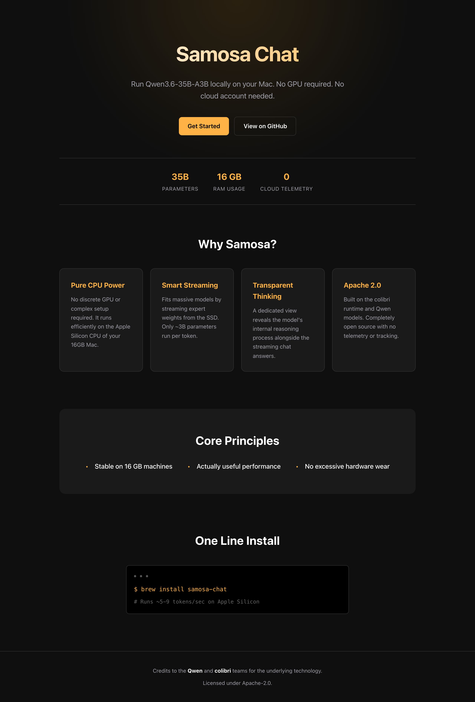

<div align="center">
  
  <h1>Samosa Chat</h1>
  <p><strong>Run Qwen3.6-35B-A3B locally on a 16 GB Apple Silicon Mac.</strong></p>
  <p>In your terminal, or in your browser &nbsp;·&nbsp; Runs on the CPU &nbsp;·&nbsp; No cloud account &nbsp;·&nbsp; No telemetry</p>

  <p>
    <a href="https://github.com/deepanwadhwa/samosa-chat/actions/workflows/ci.yml"></a>
    <a href="https://huggingface.co/deepanwa/Samosa-Chat-Qwen3.6-35B-A3B-group32"></a>
    <a href="LICENSE"></a>
  </p>
  <p>
    
    
    
    
    
  </p>
</div>

> **Credit.** Samosa Chat is built on [colibrì](https://github.com/JustVugg/colibri)
> by JustVugg. Its expert-streaming design, SIMD kernels, and core utility
> headers made this project possible. The model is the text part of
> [Qwen3.6-35B-A3B](https://huggingface.co/Qwen/Qwen3.6-35B-A3B), created and
> released by the Qwen team. Samosa Chat is an independent, unofficial,
> Apache-2.0 project. It is not affiliated with or endorsed by either team.
>
> **What Samosa adds:** its own Qwen3.6 inference engine in C — the 30 Gated
> DeltaNet layers, the 10 attention layers, and the routed-expert path — the
> group-32 quantization format and its converter, the byte-budgeted expert
> cache that fits 35B parameters into 16 GB, sealed conversations that resume
> exactly, a local server and browser app, an atomic installer that verifies
> and rolls back, and the tests around all of it.
> [The full list](#what-samosa-adds-on-top).

## What it looks like

A real, unedited recording on the 16 GB M3 MacBook Air — a question in, an
answer out, no cloud:

<p align="center"></p>

Real time, played at normal speed. The pause before the answer is the model
loading; after that it writes at about 5–9 tokens per second.

## Install

```sh
curl -fsSL https://huggingface.co/deepanwa/Samosa-Chat-Qwen3.6-35B-A3B-group32/resolve/main/install.sh | sh
```

Then **open a new terminal** and ask it something:

```sh
samosa "explain how DNS works"
```

You need an Apple Silicon Mac, 16 GB of RAM, Apple's Command Line Tools (for the
C compiler), and about 30 GB of free disk. The download is about 24 GB. The
installer resumes interrupted downloads, checks the SHA-256 of every file,
compiles the C engine on your machine, and smoke-tests it before switching the
new release live. A corrupt or interrupted upgrade leaves your existing install
untouched. It does not need administrator rights.

### Where Samosa is installed

Everything lives under `~/.samosa`, and nothing is installed system-wide:

| path | what it is |
|---|---|
| `~/.samosa/bin/samosa` | the `samosa` command itself |
| `~/.samosa/current` | symlink to the active release |
| `~/.samosa/releases/` | verified releases, kept so an upgrade can roll back |
| `~/.samosa/chats/` | your saved conversations |

The installer adds `~/.samosa/bin` to your `PATH` by appending one line to your
shell's rc file (`~/.zshrc` for zsh, `~/.bashrc` for bash, otherwise
`~/.profile`). **That only affects terminals you open afterwards** — which is
why the step above says to open a new one. If `samosa` still is not found:

```sh
# make it work in the terminal you already have
export PATH="$HOME/.samosa/bin:$PATH"

# or skip PATH entirely and run it directly
~/.samosa/bin/samosa "how are you"
```

`samosa doctor` reports which release is active and whether the model, engine,
and tokenizer are healthy.

To uninstall, delete `~/.samosa` and remove that one line from your rc file.

The model lives at
[deepanwa/Samosa-Chat-Qwen3.6-35B-A3B-group32](https://huggingface.co/deepanwa/Samosa-Chat-Qwen3.6-35B-A3B-group32).

## Two ways to use it

Both come from the same install. Pick based on what you want:

| | [Terminal](#chat-in-your-terminal) | [Web app](#the-web-app-a-demo) |
|---|---|---|
| Command | `samosa "your question"` | `samosa app` |
| What it is | **the normal way to use Samosa** | **a demo** |
| Good for | actually chatting, scripting, piping output | seeing tokens stream and watching the model think |

**If you just want to chat with the model, use the terminal.** It starts
instantly, does everything the model can do, and is the interface that gets used
day to day.

**The web app is a demo at this point.** It works, and it is the nicest way to
watch answers stream in and see the model's reasoning unfold. But it exists to
demonstrate the engine, not as a polished product. Do not feel you need it.

## What this is

Samosa Chat runs Qwen's 35-billion-parameter model on a Mac that has only 16 GB
of RAM.

The model is a Mixture of Experts. It has 35B parameters in total, but it only
uses about 3B of them for each token. Samosa never loads all 35B into memory.
The shared ("dense") weights stay in RAM. The expert weights are read from the
SSD as the model chooses which experts each token needs.

Samosa runs entirely on the CPU. It does not use Metal or the Apple GPU. You do
not need a dedicated GPU.

The model is text only. Qwen3.6 can also read images, but Samosa's converted
model leaves the image part out.

**Where it runs.** macOS on Apple Silicon (`arm64`) natively, or Windows and Linux via Docker Desktop (which runs a Linux VM). It has been tested natively on one 16 GB M3 MacBook Air. "Runs on the CPU" does **not** mean it runs on any 16 GB laptop. The native installer refuses other systems, but the Docker image can package the POSIX server for any platform.

## Docker (Linux & Windows)

For Windows and Linux, Samosa Chat runs inside a Docker container (on Windows, this runs via Docker Desktop using a Linux VM).

### Prerequisites

1. **Docker Desktop** (or Podman / Rancher Desktop), and **git**.

2. **Give the Docker VM at least 6 GB of RAM** (8 GB recommended). The default is
   about 2 GB, which **cannot load the model at all** — it fails without a useful
   error. This is the single most common way to waste an hour here.

   * **Windows (WSL2 backend — the default):** the memory slider in Docker
     Desktop's Settings does **not** apply. You must create or edit
     `%USERPROFILE%\.wslconfig`:

     ```ini
     [wsl2]
     memory=8GB
     ```

     Then run `wsl --shutdown` in PowerShell and restart Docker Desktop.
   * **Windows (Hyper-V backend) / macOS:** Docker Desktop → Settings →
     Resources → Memory.

   Verify it took: `docker info --format "{{.MemTotal}}"` should report ~8e9,
   not ~2e9.

3. **Storage:** ~30 GB free **inside the Docker virtual disk**, on top of
   whatever is already in it. The model volume alone is 24 GB. Check with
   `docker system df`; if the disk is full, `docker builder prune` frees cache.

4. **A fast internal SSD (NVMe).** Samosa streams expert weights from disk on
   every token — storage bandwidth is the main driver of speed. See
   [SSD speed](#ssd-speed-the-one-thing-to-be-deliberate-about).

> **Windows users:** the commands below are written on one line each, so they
> paste into **PowerShell** or **cmd** unchanged. (Multi-line shell examples
> elsewhere in this README use `\` continuations, which are POSIX-only and will
> fail in PowerShell.)

### 1. Build the image

There is no published image yet, so build it from this repository. The build
compiles the C engine from source — the same property the native installer has:
you run code you can read.

```sh
git clone https://github.com/deepanwadhwa/samosa-chat
cd samosa-chat
docker build -t samosa .
```

Takes about a minute and produces a ~90 MB image. The 24 GB model is **not** in
the image — it goes in a volume, next.

### 2. Create a named Docker volume
To get native SSD performance, the 24 GB model must live inside a named Docker volume (which lives inside the VM's ext4 virtual disk). **Never use a host bind mount (e.g. mounting from `C:\Users\...` or `/home/...`), as the file sharing layer (virtiofs/9p) will slow inference down by about 6x — measured.**

```sh
docker volume create samosa-model
```

### 3. Pull the model weights
Downloads the 24 GB group-32 weights into the volume, verifying every file by
size and SHA-256 against the release manifest. **Interrupted downloads resume** —
just re-run the same command. Expect roughly 20 minutes on a fast connection.

```sh
docker run --rm -v samosa-model:/model samosa pull
```

### 4. Start the server
The engine binds loopback by default; inside the container that is the
container's own namespace, so the image sets `SAMOSA_BIND=0.0.0.0` and you
publish the port to the host's **localhost only**:

```sh
docker run -d --name samosa -p 127.0.0.1:8642:8642 -v samosa-model:/model --memory=8g samosa serve
```

**Publish it as `-p 127.0.0.1:8642:8642`, not `-p 8642:8642`.** The second form
binds your machine's `0.0.0.0` and exposes the model server to your whole
network.

### 5. Chat in your browser
* http://127.0.0.1:8642

Check the install at any time with `docker exec samosa samosa doctor`.

### Known limitation on x86 machines

Today the image compiles without `-march`, so on x86 CPUs the vectorised (AVX2)
kernels are not compiled in and the engine falls back to a scalar path measured
**7.6x slower** than the vectorised one. It is correct, just slow. The fix
(runtime CPU dispatch) is tracked as **G10 / H2** in
[docs/TASKS_HARDWARE.md](docs/TASKS_HARDWARE.md). Expect a working chat, not the
speeds quoted for the reference Mac.


## Chat in your terminal

This is the main way to use Samosa. Ask a question, get an answer:

```sh
samosa "explain how a hash table handles collisions"
```

Keep the conversation going with `--continue`. Your chat resumes from a saved
snapshot, so a follow-up does not re-read the whole history:

```sh
samosa "explain how a hash table handles collisions"
samosa --continue "and which strategy does Python use?"
samosa --continue "show me the CPython source for that"
```

The rest of the options:

```sh
samosa --think "solve this logic puzzle"                # general reasoning
samosa --think-code "build a responsive settings page"  # precise coding profile
samosa --fast "summarize this design"                   # adaptive threads, runs warmer
samosa --seed 11 "give me a deterministic sample"       # reproducible sampling
samosa --max-tokens 2048 "write a long explanation"     # change the ceiling
samosa --thinking-budget 512 "..."                      # cap internal reasoning
samosa doctor                                           # check the installation
```

An answer can run up to 8,192 new tokens. That is an outer ceiling, not a target
— the model usually stops earlier on its own when it emits its end-of-turn
token. Two threads is the default so the Mac stays cool; `--fast` enables
adaptive thermal thread scaling — it uses more cores when the machine
has thermal headroom, and backs off when it gets hot.

By default the model answers directly. `--think` and `--think-code` turn on
reasoning, which is slower and consumes more battery/power because it does
many more SSD read passes. Use direct mode unless you need deep thinking
to get results faster and keep the machine cooler. See
[SSD speed](#ssd-speed-the-one-thing-to-be-deliberate-about) for details.

A conversation is capped at 24,576 tokens total (saved history + your new
message + the answer ceiling). Samosa checks this before it runs and stops
rather than growing memory without limit.

## The web app (a demo)

`samosa app` starts a local server and opens a chat page in your browser.
Everything runs on your machine. The page makes no outside requests.

```sh
samosa serve          # start the server in the foreground on 127.0.0.1:8642
samosa app            # start the server in the background and open the chat page
samosa serve --stop   # stop the server
```

What the app does:

- Streams the answer as the model writes it.
- Shows the model's thinking separately from its final answer.
- Lets you stop a generation at any time.
- Saves your conversations so you can continue them later.
- Shows live speed (tokens per second) and current memory use.
- Has settings for thinking mode, maximum answer length, and a fixed seed.

The server answers these HTTP endpoints:

- `GET /healthz` — status, memory use, the context limit, queue state, last speed
- `GET /v1/models`
- `POST /v1/chat/completions` — reply as JSON, or stream token by token (SSE)
- `POST /v1/cancel` — stop the current generation
- `POST /v1/shutdown` — stop the server cleanly

Only one request runs at a time. Extra requests wait in a short queue.

**Stopping an answer is safe.** When you stop an answer partway through, Samosa
saves the conversation only up to the last complete sentence. This matters:
before this fix, if you stopped an answer in the middle of a sentence, the next
answer in that chat would copy the cut-off style and reply with only a word or
two before stopping. That is now fixed. If a stopped answer has no complete
sentence yet, Samosa keeps the previous saved state instead of overwriting it.

**Context limit.** The same 24,576-token cap applies here. The server checks a
turn before queueing it and rejects an oversized one before allocating any
memory. Only the conversation you are using is loaded into RAM; opening other
saved chats does not add to memory.

## Build from source

You do not need this to use Samosa — the installer above compiles the engine for
you. This is for working on it.

```sh
make            # portable CPU build
make omp        # multithreaded build (needs libomp on macOS)
make test       # run the bounded tests
```

`make` builds the engine only, and has no Python dependency. To run it you also
need the model files and tokenizer: either the published group-32 download
above, or your own conversion from the original Qwen checkpoint with
`tools/convert_qwen36.py`. With the engine and model in place, `samosa serve`
and `samosa app` start the server. Full server details and the exact request
format are in [docs/SERVE_API.md](docs/SERVE_API.md).

Python is only used for conversion, analysis, and testing. It is not needed to
run the model.

## The three principles

Every decision follows these three goals, in this order:

1. **It must be stable on a machine like this one** — a 16 GB Apple Silicon Mac.
   Memory stays bounded. It does not grow without limit. It stops at clear
   limits instead of crashing.
2. **It must be actually useful.** Real answers, real code, real multi-turn
   conversations. Not a demo that only loads.
3. **It must not wear out the machine.** Keep memory bounded so the system does
   not swap heavily. Use two threads by default so the Mac stays cool. Be
   deliberate with the heavy SSD read passes that drain battery/power and generate heat (explained below).

A feature is only called "released" once it meets all three. Until then it
stays in this repository as source.

## What Samosa adds on top

The Qwen model and the colibrì runtime are the starting point. This repository
adds:

- A Qwen3.6 text engine written in C. It covers the 30 Gated DeltaNet layers,
  the 10 gated attention layers, the shared and routed expert path, the
  tokenizer, and the chat template.
- A converter that turns the original Qwen checkpoint into Samosa's format,
  shard by shard, with a manifest-based container for the expert weights.
- Three weight formats: the older whole-row int4, the newer group-32 int4, and
  an experimental mixed format (group int4 for gate/up, row int8 for the
  down-projection).
- CPU math for those formats: Apple NEON dot-product on Apple Silicon, and a
  portable AVX2 path for other CPUs.
- An expert cache that keeps a fixed byte budget in RAM, drops the
  least-recently-used experts first, keeps a floor per layer, reuses freed
  memory, watches system memory pressure, and reports its I/O.
- Saved conversations (`QWSESS01` files) that are checked against the model
  geometry, sealed with a SHA-256 hash, written atomically, and can be resumed
  exactly.
- Qwen's published sampling settings for direct, general-thinking, and
  precise-code modes.
- A thinking-budget limit with a clean hand-off to the answer, separate counts
  for natural versus forced endings, and a guard that stops a repeating token
  loop.
- A local HTTP server in C with no dependencies: JSON or streaming replies, a
  bounded request queue, cancellation, health reporting, and clean shutdown.
- A 32 KB browser chat page with no external scripts, no analytics, and no
  outside requests, shipped with the Samosa logo.
- An installer that verifies and tests a new version in place before switching
  to it, and rolls back if the new version is bad.
- Test tooling for output structure, task correctness, upstream comparisons,
  the quantized math, route traces, installer rollback, and memory-pressure
  limits.

## Thinking modes

Samosa uses Qwen's published sampling settings:

| mode | temperature | top-p | top-k | presence penalty | thinking budget |
|---|---:|---:|---:|---:|---:|
| direct | 0.7 | 0.80 | 20 | 1.5 | off |
| general thinking | 1.0 | 0.95 | 20 | 1.5 | 1,024 tokens |
| precise code | 0.6 | 0.95 | 20 | 0.0 | 2,048 tokens |

The maximum answer length is an outer limit, up to 8,192 new tokens. It is not a
fixed length. The model decides when to stop within that limit. If the thinking
reaches its budget, Samosa adds Qwen's trained wind-down text before closing the
`</think>` block, rather than cutting it off with a bare token. Closing the
thinking block keeps the output well-formed; it does not prove the answer is
correct.

One test compared this against an upstream FP8 reference on a small set of
arithmetic problems. The reference used 353–616 thinking tokens. A matching
local group-32 run answered correctly and stopped on its own after 933 tokens
with a 1,024-token thinking budget. This confirms the path works for that one
kind of problem. It is not proof of broad benchmark quality. See the
[upstream-control report](docs/UPSTREAM_CONTROL_2026-07-14.md) and the
[regression ledger](docs/REGRESSION_LEDGER.md).

## What group-32 is

Group-32 is the model format Samosa Chat uses. This section explains what it
means, because it is the heart of the product.

Qwen describes the model as 35B parameters in total, about 3B used per token,
40 layers, 256 routed experts, and 8 routed plus 1 shared expert active in each
Mixture-of-Experts layer. To fit that on a 16 GB Mac, Samosa stores most weights
in int4 — 4 bits each instead of 16. Four bits cannot hold a real number on
their own, so each weight also needs a **scale**: a full-precision number that
the 4-bit value is multiplied by to reconstruct the original weight.

The question is how many weights share one scale.

- **Group-32** gives every block of **32 weights** its own scale. A scale only
  has to cover 32 nearby numbers, so it fits them closely. The reconstructed
  weights are close to the originals, and the model's output quality is good.
- The older approach (see below) gave a whole matrix **row** — hundreds or
  thousands of weights — a single scale. One scale cannot fit that many
  different numbers well, so the reconstructed weights drift from the originals
  and the output shows visible defects.

Finer scales cost more storage, which is why group-32 is larger on disk:

| part | group-32 (the product) | older whole-row |
|---|---:|---:|
| expert weights | 20.94 GB | 16.6 GB |
| shared weights | 3.02 GB | 1.3 GB |

Group-32 also keeps the down-projection weights at int8 (8 bits) rather than
int4, which is the main reason its shared weights are larger. The result is a
model that reconstructs the original Qwen weights with measurably less error
than the older format. It is what the app runs, and it is the published release:
[deepanwa/Samosa-Chat-Qwen3.6-35B-A3B-group32](https://huggingface.co/deepanwa/Samosa-Chat-Qwen3.6-35B-A3B-group32).
Its quality is measured on one reference machine and one reasoning control, not
across a broad benchmark suite — see [Known limitations](#known-limitations).

## What we tried that did not work

**Whole-row int4 (the first format).** This was the first quantization attempt:
one int4 scale for an entire weight row. It is too coarse. A single scale has to
cover a whole row of weights with very different sizes, so many weights are
reconstructed inaccurately. In use this shows up as word-level defects such as
`of ofof`. Re-asking or changing the seed can avoid a given case but does not fix
the cause. This is exactly why group-32 was built, and group-32 replaced it as
the product. The old format still exists in an
[earlier Hugging Face repo](https://huggingface.co/deepanwa/Samosa-Chat-Qwen3.6-35B-A3B-int4),
kept only so existing installs keep working. Do not start there.

**Mixed int4/int8 format.** An attempt to use int4 for the gate and up
projections and int8 for the down projection across the whole model. The code
for it exists and its math is tested, but no full model was ever produced in
this format. It is not used by the product.

## Speed

All numbers are from one fanless MacBook Air M3 with 16 GB of RAM. They describe
specific runs on this one machine, not a guarantee for other machines.

The product is group-32, so those numbers come first:

| group-32 task | threads | speed |
|---|---:|---:|
| direct answer | 2 | 7.27 tokens/sec |
| 933-token thinking answer | 2 | 4.85 tokens/sec |
| 5,000-token code page | 4 | 6.47 tokens/sec |

For reference, the older published model runs slightly faster because it is
smaller: about 7–8 tokens/sec on 2 threads, about 9.5 on 4 threads (`--fast`),
and 14–24 tokens/sec for prefill.

Decode is the speed of writing the answer. Prefill is the speed of reading your
input before it starts. Prefill is the slow part for long inputs: reading a
5,000-token document once takes about 3.5–6 minutes. Saved conversations mean a
document is read only once.

## Memory use

On the command-line tool, older runs used about 2.5–3 GB and group-32 runs used
about 3.2–3.9 GB.

In the app, memory grows in three stages:

1. **Model loaded, no chat yet:** about **2.5 GiB**.
2. **After the first answer:** about **3.9 GiB**. The first answer fills the
   expert cache, which adds about 1.3 GB and then holds steady.
3. **As a conversation gets longer:** memory rises slowly with the length of the
   conversation you are in. In one test it rose about 143 MB while a single chat
   grew from 176 to 1,017 tokens. The expert cache stayed flat at 1.29 GB the
   whole time.

That growth is bounded, not a leak. The per-token memory (the KV cache) is about
40 KiB per token across the 10 attention layers. The measured rise is a little
higher because the memory allocator holds on to its high point. For a
conversation of fixed length, memory levels off — an eight-turn test on the same
length held at **3.91–3.92 GiB**. The 24,576-token limit caps the worst case at
roughly **5–5.5 GiB** after a maximum-length chat. Only one conversation is in
memory at a time.

The memory number the app shows is the real macOS "physical footprint," which
matches Activity Monitor.

A note on swap: on macOS, swap can stay in use from an earlier busy period even
after memory frees up. macOS does not shrink the swap file or pull that data
back on its own. So swap being in use does **not** by itself mean Samosa is
swapping now. The signal to trust is green memory pressure.

Each saved turn writes a 63–70 MB sealed file to disk. The model files
themselves are read-only.

## SSD speed: the one thing to be deliberate about

This is the most important part for understanding the performance and resource footprint of your machine, so it is stated plainly.

Samosa keeps its memory footprint small by **not** holding all 35B parameters in RAM. Instead, it reads each token's expert weights from the SSD as the model chooses them. The longer an answer is, the more expert data it reads.

The amount of data read is large. One 933-token thinking answer read **376 GB** of expert data from the SSD.

### Does this wear out the SSD? No — and the comparison people reach for is backwards

Reading 376 GB sounds alarming, so this section used to say that expert streaming
is what wears the drive. **That was wrong, and it is corrected here.**

**SSD lifespan is consumed by writes, not reads.** Flash endurance is rated in
**TBW** (Terabytes *Written*, per the JEDEC JESD218 standard) or **DWPD** (Drive
*Writes* Per Day). Every published endurance figure is a write figure — no
manufacturer rates a drive for reads, because program/erase cycles are what wear
out NAND cells. Reads consume approximately zero drive life.

The honest caveat: *read disturb* is a real physical effect — reading a block
slightly perturbs neighbouring cells, and the controller refreshes the block after
a threshold, which is a write. But those thresholds are on the order of tens of
thousands to millions of reads **of the same block**. 376 GB spread over a 20.9 GB
file is about 18 reads per byte. It is orders of magnitude away from mattering.

Which inverts the swap comparison this section used to make. Over that same
session the whole system — Samosa, editor, browser, everything — wrote under about
9 GB to swap. Those **9 GB of writes consume more drive life than the 376 GB of
reads do.** The scary number was the wrong number.

*How we know:* from the definition of the endurance rating, not from a measurement
on the reference machine — Apple Silicon's internal NVMe does not expose SMART
endurance counters to userspace, so `Data Units Written` / `Percentage Used`
cannot be read there. On a Linux machine with `smartctl -A /dev/nvme0`, a long
generation moves `Data Units Read` by hundreds of GB while leaving
`Data Units Written` and `Percentage Used` essentially unchanged. If you run
Samosa on such a machine, you can check this yourself.

The genuine resource considerations are:
- **SSD Speed:** This is the single biggest driver of Samosa's performance. High-speed native NVMe storage (2.3+ GB/s) streams at **5–7 tokens/second**. Slower storage paths (like a Docker virtiofs host bind mount at ~0.5 GB/s) drop this to **~0.9 tokens/second**. SATA SSDs or HDDs are severely bottlenecked or unusable.
- **Power and Heat:** Streaming hundreds of gigabytes per generation keeps the CPU and storage controller active, which drains battery and generates heat.
- **Page Cache Eviction:** Heavy read operations evict other files from the OS page cache, which can temporarily slow down other active applications.

What this means for you:
- **SSD speed matters enormously.** Run Samosa on a fast internal NVMe drive (or a native Docker volume), never on a slow host shared mount or external SATA SSD.
- **Use direct mode for efficiency.** A short factual answer reads very little. A long reasoning turn reads a lot. Use direct mode (`thinking: off` in the app, `--direct` on the command line) when you do not need step-by-step reasoning to conserve battery and keep the machine cool.
- **The default is 2 threads** so the machine stays cool. `--fast` turns on adaptive thermal thread control to scale up performance safely when thermal headroom allows.

## Example output from the group-32 model

Everything here was generated by the **group-32 model** — the product — through
the app's chat endpoint in direct mode (no thinking, seed 11) on the 16 GB
reference Mac. The screenshot is not edited.

Asked to build its own landing page — a single HTML file with embedded CSS, no
JavaScript, dark theme, given the facts about Samosa Chat — the model produced
this:

<p align="center"></p>

This run: 2,528 tokens, 5.15 tokens/sec, 4.33 GB memory. The exact HTML it wrote
is saved at [assets/example-landing.html](assets/example-landing.html). (The
`brew install` line in the page is the model's own copy; the real install
command is the one above.)

Asked for a Python function, the group-32 model wrote this, and it passes its
own tests when run:

```python
from typing import List


def merge_intervals(intervals: List[List[int]]) -> List[List[int]]:
    """Merge overlapping intervals.

    Args:
        intervals: A list of intervals, each represented as [start, end].

    Returns:
        A list of non-overlapping intervals that cover all input intervals.
    """
    if not intervals:
        return []

    # Sort by start time
    sorted_intervals = sorted(intervals, key=lambda x: x[0])
    merged = [sorted_intervals[0]]

    for current in sorted_intervals[1:]:
        last = merged[-1]
        if current[0] <= last[1]:
            # Overlapping intervals, merge them
            last[1] = max(last[1], current[1])
        else:
            merged.append(current)

    return merged


# Test cases
assert merge_intervals([[1, 3], [2, 6], [8, 10], [15, 18]]) == [[1, 6], [8, 10], [15, 18]]
assert merge_intervals([[1, 4], [4, 5]]) == [[1, 5]]
assert merge_intervals([]) == []
```

This run: 279 tokens, 7.19 tokens/sec, 4.09 GB memory.

## Testing

`make test` covers the expert cache, the long-context KV math, the repetition
guard, the thinking wind-down, the quantized math, the server, the command-line
wrapper, installer rollback, output structure, route analysis, and the converter
layout. The multithreaded build and the shell and Python syntax checks also run.

An earlier test harness had a serious false positive: it reported 14 of 15
passes using substring checks, even though 0 of 15 answers actually closed their
`</think>` block. Structural closing, natural versus forced endings, repetition,
model stop, and task correctness are now scored separately. There is still not
enough evidence to publish a general benchmark score. The planned evaluation
steps are in [docs/BENCHMARK_PLAN.md](docs/BENCHMARK_PLAN.md).

## Privacy and machine safety

- The model runs on your machine. The engine has no telemetry. The server
  listens on local loopback only.
- The installer contacts Hugging Face only to download the public release files.
  Running the model does not need a cloud account.
- The macOS build is CPU-only. It uses NEON and optional OpenMP, not Metal.
- Two threads is the cool default. `--fast` is a deliberate choice.
- The expert cache watches memory pressure and can drop cached experts before
  the system is forced to swap.
- In the server, a generation can be cancelled between tokens.
- Real-model test runs are kept short because one long run can read hundreds of
  gigabytes from the SSD.

## Roadmap

Nothing here is promised or dated. This is what the project wants to become,
roughly in order of how much it would change things.

### Run on any machine with 16 GB of RAM

Today this is macOS on Apple Silicon only, and that is the single biggest limit
on who can use Samosa. **The goal is that anyone with 16 GB of RAM can run it —
Windows, Linux, and Intel machines included.**

The math is not the blocker: the engine is plain C and already carries portable
AVX2 kernels next to the Apple NEON ones. The real work is everything around
them — the installer refuses non-Apple-Silicon systems today, memory planning
and the memory-pressure watcher call macOS-specific APIs (`sysctl`, Mach), and
no other platform has been tested as a product. None of that is fundamental;
it just has not been done.

### Vision

Qwen3.6 is natively multimodal, but Samosa's converter deliberately drops the
vision tower and converts only the text half of the model. That was a scope and
memory decision, not a limitation of the idea: the engine has no vision runtime,
and a 16 GB budget had no room to keep an image encoder resident.

**The goal is to add image input back.** It means building a vision encoder
alongside the language engine — roughly "colibrì, but for vision": an image
encoder, patch embedding, and a projector into the language model's space.
The tokenizer still carries Qwen's image and video tokens, so the language side
is already ready for it.

### Metal (Apple GPU)

The engine is CPU-only today. Metal should help, but it is not free speed: much
of a long answer is spent streaming expert weights from the SSD, and a GPU does
not make those reads faster. The plan is to move the expert matrix multiplies to
Metal while CPU threads keep feeding them from disk, then measure end-to-end
tokens/sec, SSD reads, memory, thermals, and battery — not just an isolated fast
matmul. The CPU path stays as the correctness fallback.

### A more mature app

The web app is a demo. To become a real interface it needs conversations kept in
RAM instead of re-read from disk each turn, transcript management on the server,
and deleting a chat should remove its saved snapshot, not just the browser copy.
Chatting over a document and web access are wanted after that.

### Real quality evidence

Group-32 is measured on one machine against one reasoning control. It needs a
proper benchmark suite, comparison against upstream across task types, and a
bounded test for very long answers (a crash above 4,096 tokens was fixed, but
the regression test for it is not written yet).

## Known limitations

- **macOS on Apple Silicon only.** Linux code paths exist but are unverified.
  Windows is not supported. See the roadmap above.
- **Text only.** No images, video, audio, or tool calling.
- **No GPU acceleration.** Part of every answer is limited by SSD read speed.
- **Quality evidence is thin.** Group-32 is proven on one reference machine and
  one reasoning control, not across many machines or task types.
- **SSD speed is the bottleneck.** Expert weights are streamed from the SSD on
  every token. Performance scales directly with storage bandwidth.
  See [SSD speed](#ssd-speed-the-one-thing-to-be-deliberate-about).
- Deleting a chat in the app removes it from the browser but does not yet delete
  its saved file on disk.

## More documentation

- [App task program](docs/APP_TASKS.md)
- [Server API and acceptance tests](docs/SERVE_API.md)
- [Thinking-mode diagnosis](docs/THINKING_DIAGNOSIS.md)
- [Group-32 model notes](docs/GROUP32_BASELINE.md)
- [Storage migration log](docs/STORAGE_MIGRATION_2026-07-14.md)
- [Upstream comparison](docs/UPSTREAM_CONTROL_2026-07-14.md)
- [Detailed work log](docs/WORK_LOG_2026-07-14.md)

## License

Apache-2.0. See [LICENSE](LICENSE) and [NOTICE](NOTICE) for the full attribution
and derivative-work notice.
